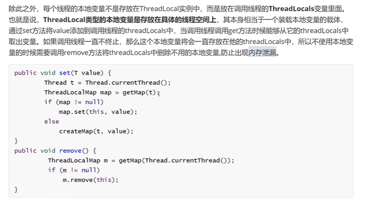

# 22-12-27

## 1.MySQL索引结构？

+ B+Tree索引
+ Hash索引
+ full-text全文索引
+ R-Tree索引

## 2.redis持久化策略？

### 什么是要持久化，有啥用？

> 简单说将内存数据保存到硬盘，防止机器重启后数据丢失

## 3.zookeeper节点类型说一下

ZooKeeper是个分布式开放源码的分布式应用程序协调服务，是Hadoop和Hbase的重要组件。ZooKeeper服务端支持7种节点类型分别是：**持久、持久顺序、临时、临时顺序、容器、持久 TTL、持久顺序 TTL。**

**接下来具体介绍下ZooKeeper的节点类型:**

**1、持久、临时**

持久是用的最多的一种类型也是默认的节点类型，临时节点相较于持久节点来说就是它会随着客户端会话结束而被删除，通常可以用在一些特定的场景，如[分布式锁](https://so.csdn.net/so/search?q=分布式锁&spm=1001.2101.3001.7020)释放、健康检查等。

**2、持久顺序、临时顺序**

这两种放在一起介绍，他们相对于上面两种的特性就是ZK会自动在这两种节点之后增加一个数字的后缀，而路径 + 数字后缀是能保证唯一的，这数字后缀的应用场景可以实现诸如分布式队列，分布式公平锁等。

**3、容器**

容器节点是 3.5 以后新增的节点类型，只要在调用 create 方法时指定 CreateMode 为 CONTAINER 即可创建容器的节点类型，容器节点的表现形式和持久节点是一样的，但是区别是 ZK 服务端启动后，会有一个单独的线程去扫描，所有的容器节点，当发现容器节点的子节点数量为 0 时，会自动删除该节点，除此之外和持久节点没有区别，官方注释给出的使用场景是 Container nodes are special purpose nodes useful for recipes such as leader, lock, etc. 说可以用在 leader 或者锁的场景中。

**4、持久 TTL、持久顺序 TTL**

关于持久和顺序这两个关键字，不用我再解释了，这两种类型的节点重点是后面的 TTL，TTL 是 time to live 的缩写，指带有存活时间，简单来说就是当该节点下面没有子节点的话，超过了 TTL 指定时间后就会被自动删除，特性跟上面的容器节点很像，只是容器节点没有超时时间而已，但是 TTL 启用是需要额外的配置(这个之前也有提过)配置是 zookeeper.extendedTypesEnabled 需要配置成 true，否则的话创建 TTL 时会收到 Unimplemented 的报错。

> ZooKeeper以Fast [Paxos](https://so.csdn.net/so/search?q=Paxos&spm=1001.2101.3001.7020)算法为基础，Paxos 算法存在活锁的问题，即当有多个proposer交错提交时有可能互相排斥导致没有一个proposer能提交成功，而Fast Paxos做了一些优化，通过选举产生一个领导者，只有leader才能提交proposer具体算法可见Fast Paxos。要想弄懂ZooKeeper首先得对Fast Paxos有所了解。

> ZooKeeper目标是封装好复杂易出错的关键服务，将简单易用的接口和性能高效、功能稳定的系统提供给用户。ZooKeeper包含一个简单的原语集提供Java和C的接口。


## 4.zookeeper选举机制？

## 5.zookeeper主节点故障，如何重新选举？

## 6.syn机制？（SPI?）

## 7.线程池的核心参数？

我们创建线程的常见方式一般有继承Thread类以及实现Runnable接口，其实Thread类也是实现了Runnable接口。通过这两种方式创建的线程，在执行完毕之后都会被销毁，这样频繁的创建和销毁线程是一件很浪费资源到的事情。那么，有没有什么办法解决这个问题呢?通过创建线程池就可以解决这个问题。

通过线程池创建的线程执行完毕之后并不会销毁，而是会回到线程池继续重复利用，执行其他任务。这里简单介绍一下线程池的几个主要参数：

**一、核心参数**

1. **corePoolSize（核心线程数）**
   （1）核心线程会一直存在，即使没有任务执行；
   （2）当线程数小于核心线程数的时候，即使有空闲线程，也会一直创建线程直到达到核心线程数；
   （3）设置allowCoreThreadTimeout=true（默认false）时，核心线程会超时关闭。
2. **queueCapacity（任务队列容量）**
   也叫阻塞队列，当核心线程都在运行，此时再有任务进来，会进入任务队列，排队等待线程执行。
3. **maxPoolSize（最大线程数）**
   （1）线程池里允许存在的最大线程数量；
   （2）当任务队列已满，且线程数量大于等于核心线程数时，会创建新的线程执行任务；
   （3）线程池里允许存在的最大线程数量。当任务队列已满，且线程数量大于等于核心线程数时，会创建新的线程执行任务。
4. **keepAliveTime（线程空闲时间）**
   （1）当线程空闲时间达到keepAliveTime时，线程会退出（关闭），直到线程数等于核心线程数；
   （2）如果设置了allowCoreThreadTimeout=true，则线程会退出直到线程数等于零。
5. **allowCoreThreadTimeout（允许核心线程超时）**
6. **rejectedExecutionHandler（任务拒绝处理器）**
   （1）当线程数量达到最大线程数，且任务队列已满时，会拒绝任务；
   （2）调用线程池shutdown()方法后，会等待执行完线程池的任务之后，再shutdown()。如果在调用了shutdown()方法和线程池真正shutdown()之间提交任务，会拒绝新任务。

**二、线程池参数默认值**

- corePoolSize = 1
- queueCapacity = Integer.MAX_VALUE
- maxPoolSize = Integer.MAX_VALUE
- keepAliveTime = 60秒
- allowCoreThreadTimeout = false
- rejectedExecutionHandler = AbortPolicy()

**三、ThreadPoolExecutor（线程池）执行顺序**

- - 当线程数小于核心线程数时，会一直创建线程直到线程数等于核心线程数；
  - 当线程数等于核心线程数时，新加入的任务会被放到任务队列等待执行；
  - 当任务队列已满，又有新的任务时，会创建线程直到线程数量等于最大线程数；
  - 当线程数等于最大线程数，且任务队列已满时，新加入任务会被拒绝。


## 8.threadlocal的实现，原理，业务用来做什么？

> ThreadLocal的作用主要是做数据隔离，填充的数据只属于当前线程，变量的数据对别的线程而言是相对隔离的，在多线程环境下，如何防止自己的变量被其它线程篡改。

Thread类中有两个变量threadLocals和inherritableThreadLocals,二者都是ThreadLocal内部类ThreadLocalMap类型的变量，我们通过查看内部类ThreadLocalMap可以发现实际上它类似于一个HashMap。

在默认情况下，每个线程中的这两个变量都为null；

```java
ThreadLocal.ThreadLocalMap threadLocals = null;
ThreadLocal.ThreadLocalMap inheritableThreadLocals = null;
```

只有当线程第一次调用ThreadLocal的set或者get方法的时候才会创建他们。

```JAVA
public T get(){
    Thread t = Thread.currentThread();
    ThreadLocalMap map =getMap(t);
    if(map!=null){
        ThreadLocalMap map =getMap(t);
        if(e != null){
            @SuppressWarnings("unchecked")
            T result =(T)e.value;
            return result;
        }
    }
    return setInitiaValue();
}
```

除此之外，每个线程的本地变量是存放在ThreadLocal实例中，而是放在调用线程的ThreadLocals变量里面。也就是说，ThreadLocal类型的本地变量是存放在具体的线程空间上，其本身相当于一个装载本地变量的载体，通过set……




## 9.spring DI的原理；

## 10.四次挥手

刚开始双方都处于 establised 状态，假如是客户端先发起关闭请求，则：

1. 第一次挥手：客户端发送一个 FIN 报文，报文中会指定一个序列号。此时客户端处于**FIN_WAIT1**状态。

2. 第二次挥手：服务端收到 FIN 之后，会发送 ACK 报文，且把客户端的序列号值 + 1 作为 ACK 报文的序列号值，表明已经收到客户端的报文了，此时服务端处于 **CLOSE_WAIT**状态。

3. 第三次挥手：如果服务端也想断开连接了，和客户端的第一次挥手一样，发给 FIN 报文，且指定一个序列号。此时服务端处于 **LAST_ACK** 的状态。
4. 第四次挥手：客户端收到 FIN 之后，一样发送一个 ACK 报文作为应答，且把服务端的序列号值 + 1 作为自己 ACK 报文的序列号值，此时客户端处于 **TIME_WAIT** 状态。需要过一阵子以确保服务端收到自己的 ACK 报文之后才会进入 CLOSED 状态
5. 服务端收到 ACK 报文之后，就处于关闭连接了，处于 CLOSED 状态。

## 11.gc root选择；

## 12.标记清除算法的过程，标记清楚算法如何给对象分配内存空间？

