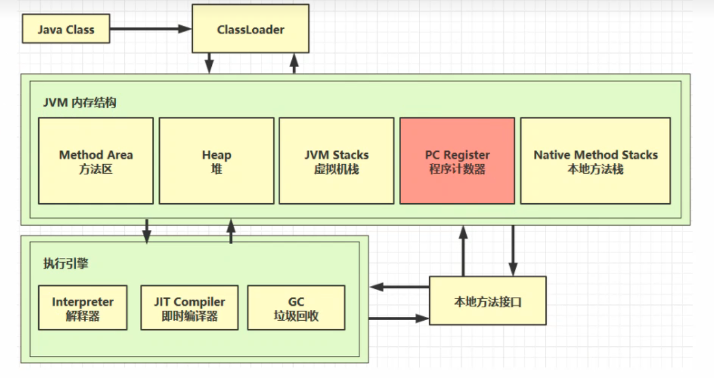

# 引言

## 1.什么是JVM？

定义：

+ Java Virtual Machine - java程序的运行环境（java 二进制字节码的运行环境）

好处：

+ 一次编写，到处运行
+ 自动内存管理，垃圾回收功能
+ 数组下标越界检查  
+ 多态（使用虚方法调用的机制实现了多态）

比较：

jdk、jre、jvm

# 内存结构

## 1.程序计数器

### 1.1 定义：

Program Counter Register 程序计数器（寄存器）

### 1.2 作用：

+ 程序计数器作用：记住下一条jvm指令的执行地址 
+ 特点：
  + 线程私有的，随着线程创建而创建，销毁而销毁
  + 不会存在内存溢出，是一块较小的内存空间

## 2.虚拟机栈

### 2.1 定义

Java Virtual Machine Stacks

+ 每个线程运行所需要的内存，称为虚拟机栈
+ 每个栈由多个栈帧（Frame）组成，对应着每次方法调用时所占用的内存
+ 每个线程只能有一个活动栈帧，对应着当前正在执行的那个方法

问题辨析

1. 垃圾回收是否涉及栈内存？

   不需要，垃圾回收只会回收堆内存中的内存占用，栈内存不需要

2. 栈内存分配越大越好吗？

    不是，内存大，分配的线程会减少，每个线程都要有独立的占内存+程序计数器，所以得合理应用，一般linux的默认栈内存（1MB）够用

3. 方法内的局部变量是否线程安全？

   - 如果方法内局部变量没有逃离方法的作用范围，它是线程安全的
   - 如果是局部变量引用了对象，或逃离方法的作用范围，需要考虑线程安全

### 2.2 栈内存溢出

StackOverflowError

+ 栈帧过多导致内存溢出
+ 栈帧过大导致内存溢出

### 2.3 线程运行诊断

案例1：cpu占用过多

+ 定位
  + 用top定位哪个进程对cpu的占用过高
  + ps H -eo pid,tid,&cpu | grep 进程id （用ps命令进一步定位是哪个线程引起的cpu占用过高）
  + jstack 进程id
    + 可以根据线程id找到有问题的线程，进一步定位到问题代码的源码行号

案例2：程序运行很长时间没有结果

## 3.本地方法栈

本地方法的内存空间

